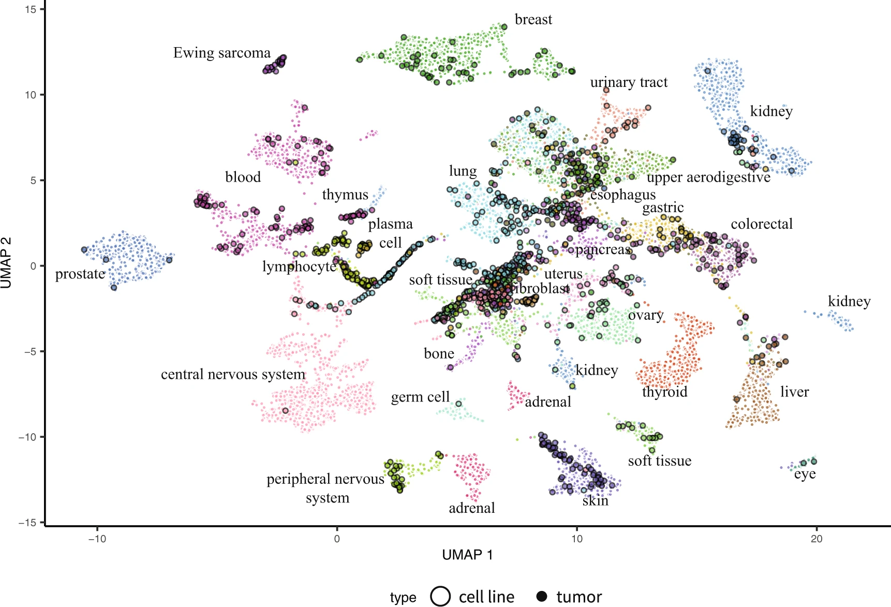

# Celligner



__Celligner__ is a computational project to align multiple cancer datasets across sequencing modalities, tissue conditions (media, perturbations..) and format (CL/tumor/organoids/spheroids)

See our latest paper on aligning CCLE cell lines with TCGA tumors:
[2020 paper](https://www.nature.com/articles/s41467-020-20294-x)

## Remark

__Celligner__ is initially an R project that you can find in the `R/` folder.

A Python version was made that performs the exact same computations as the R version. However one should not expect the exact same plot for a couple reasons:

#### UMAP

The plot some users have been used to is a unique run of UMAP on the __Celligner__ realignment data. This is done by fixing the seed of the UMAP algorithm. You can still do that for the python version but it is disabled by default and not recommended. We recommend users to play with the UMAP parameter and make multiple plots. 
This helps to prevent reading too much into UMAP's output. Things that don't stay the same are not necessarily true attributes of the data.

Learn more here: [distill](https://distill.pub/2016/misread-tsne/), [Lior's twittorial](https://twitter.com/lpachter/status/1431325969411821572).

Additionally we also advice users to complement assumptions by applying methods like differential expression analysis across clusters to find any meaningful information.

#### Algorithmic differences

__Celligner__ is composed of 4 key steps:

1. A Louvain clustering: this version is the ScanPy implementation of this method while __Celligner__ is using Seurat's. There might be some slight implementation differences.
2. A limma diff expression analysis to find key variance genes across clusters for each dataset: this version is 100% similar to the R version of __Celligner__.
3. A cPCA to remove tumor impurity signal. This method is exactly the same except that the python version does exact PCA computation while the R version does an approximate version.
4. An MNN allignment: this version is 100% similar to the R version of __Celligner__ in its output.

#### Is there any other differences?

Overall improvements, yes:

1. A “pre-fitted” model is available to download here: `gs://celligner/model.pkl` (on request for now)
2. Using your own dataset and adding new dataset is super simple now with `fit()`, `transform()` syntax
3. You don’t need to rerun the entire model when adding new (adding 600 new samples take only 5mns to run)
4. The model takes much less memory to run and can run on any machine now (you don’t need 64Gb of RAM anymore), and it also takes less than an hour to fully run (on a good machine).
5. There is now an interactive plot using _Bokeh_ to better visualise your samples of interest.
6. You can now easily choose parameters and even choose between 2 different versions of MNN.

## Just want a quick look?

Go here for the production version: [https://depmap.org/portal/celligner/](https://depmap.org/portal/celligner/)

Go here for some usage examples: [https://raw.githack.com/broadinstitute/celligner/master/docs/example.html](https://raw.githack.com/broadinstitute/celligner/master/docs/example.html)

## Install

> TO see the old R package installation instruction, see the `R/`folder.

Before running pip, make sure that you have R installed.

`pip install celligner`

Even with R, some platform might not have all the required packages already installed (thanks R for being so easy to work with!)

In that case, please refer to our docker image:s

A dockerized version is available at `jkobject:pycelligner`

## For developers

see `CONTRIBUTING.md`

## Use Celligner

See `docs/Celligner_demo.[html|pdf]` for an example of usage.
(view [here](https://raw.githack.com/broadinstitute/celligner/master/docs/example.html))

celligner works like most scikit learn tool.

A user fits a dataset (e.g. CCLE tpm expression),

```python
from celligner import Celligner

my_alligner = Celligner(make_plots=True)
my_alligner.fit(CCLE_expression, CCLE_annotation)
```

and then transforms another one based on this fitted dataset

```python
my_alligner.method = "mnn_marioni"
my_alligner.mnn_kwargs = {'k1': 5, 'k2': 50, 'cosine_norm': True, "fk":5}
transformed_TCGA = my_alligner.transform(TCGA_expression, TCGA_annotation)

my_alligner.plot(color_column="tissue_type", colortable=TISSUE_COLOR, umap_kwargs={'n_neighbors': 15,'min_dist': 0.2, 'metric': 'cosine'})
```

Users can access other methods such as save(), load(), addToFit(), etc, as well as many data in values: pca_transform, transform_clusters, differential_genes_names, mnn_pairs, etc.

Please have a look at `docs/Celligner_demo.[html|pdf]` for an example of usage.
(view [here](https://raw.githack.com/broadinstitute/celligner/master/docs/example.html))

### Computational complexity

Depending on the dataset, Celligner can be quite memory hungry.
for TCGA, expect at least _50-60Gb_ of memory being used. You might need a powerfull computer, lots of _swap_ and to increase R's default _maximum allowed memory_.

You can also use the `low_memory=True` option to reduce the memory used by celligner in the memory intensive `PCA` & `cPCA` methods.
  
### Add your own data to a pretrained model

If you want to see your dataset in celligner, you can decide to use our own prefitted version.

```python
! curl https://storage.googleapis.com/celligner/model.pkl -output temp/model.pkl

from celligner import Celligner

my_alligner = Celligner()
my_alligner.load('temp/model.pkl')
```

We fit the model with CCLE and then transform TCGA. But you can decide differently.

For example: If you want to see how some of your newly sequenced tumors mapped to the CCLE (and TCGA) dataset, just load the model as displayed above and then run:

```python
my_alligner.addTotransform(your_tpm, your_annotations)
my_alligner.plot()
```

This way you will not rerun the entire model.

See `docs/Celligner_demo.[html|pdf]` for other examples of usage.
(view [here](https://raw.githack.com/broadinstitute/celligner/master/docs/example.html))

## Multidataset alignment

Dee `docs/Celligner_demo.[html|pdf]` for an example of usage.
(view [here](https://raw.githack.com/broadinstitute/celligner/master/docs/example.html))

One can use addToFit(), addToPredict() depending on whether they want to align their dataset to another or align another dataset to theirs.

If you have a very small dataset and want to align to CCLE or CGA, use the parameter `doAdd=True` in order to not rerun the entire pipeline and use cached information.

# R Celligner

For the original R version of celligner, please check the R/README.md file here: [https://github.com/broadinstitute.org/celligner/tree/master/R/README.md](https://github.com/broadinstitute.org/celligner/tree/master/R/README.md)

Please use _github issues_ for any problem related to the tool.

---

__Maintainers:__

Jérémie Kalfon @jkobject

Javad Noorbak @jnoorbak

James McFarland

__Created by:__

Allie Warren @awarren
