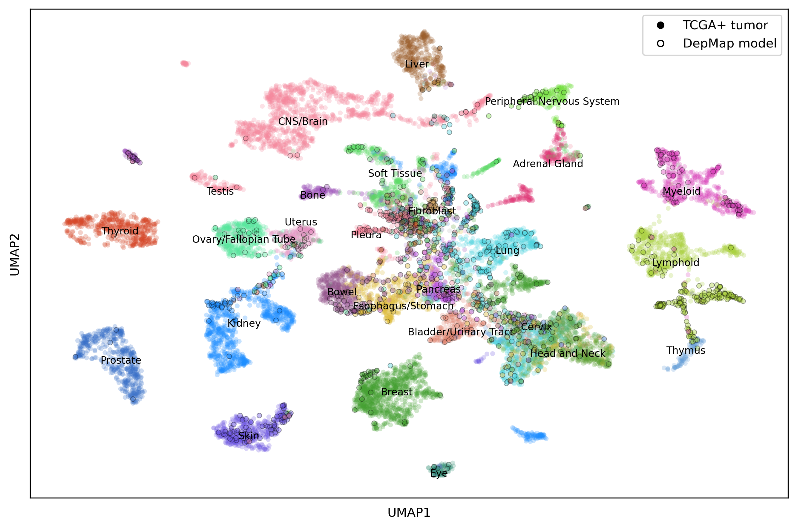
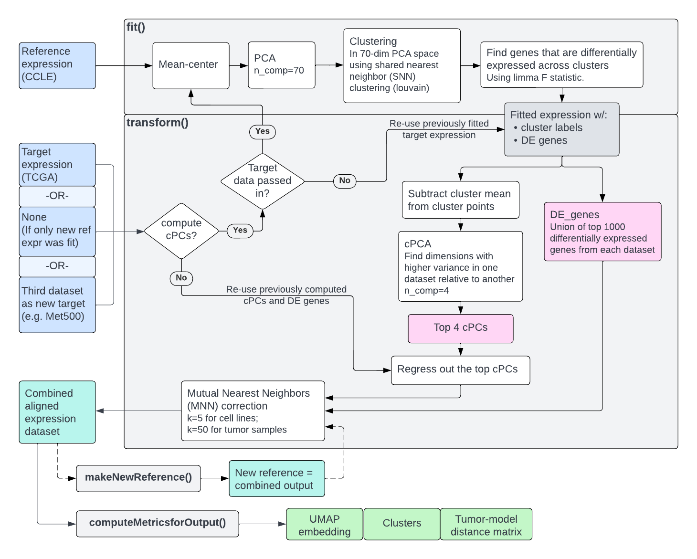

# Celligner



__Celligner__ is a computational approach for aligning tumor and cell line transcriptional profiles.

To learn more, see the [paper](https://www.nature.com/articles/s41467-020-20294-x)

## Remark

__Celligner__ is initially an R project that you can find in the `R/` folder.

A Python version was made that performs the same computations as the R version, but the results may differ slightly due to small implementation differences in the Louvain clustering and contrastive PCA steps.

## Overview

A **reference** expression dataset (e.g. CCLE cell lines) should be fit using the `fit()` function, and a **target** expression dataset (e.g. TCGA+ tumor samples) can then be aligned to this reference using the `transform()` function. See the `run_celligner.py` script for example usage. Celligner is unsupervised and does not require annotations to be run; as such they are not used in this version of the model but can be added post-hoc to aid in interpretation of the output. See the `celligner_output.ipynb` notebook for an example of how to draw an output UMAP.

The Celligner output can be explored at: [https://depmap.org/portal/celligner/](https://depmap.org/portal/celligner/)

## Install

> To see the old R package installation instruction, see the `R/` folder.

Before running pip, make sure that you have R installed.

To install the latest version of Celligner in dev mode, do:

```bash
git clone https://github.com/broadinstitute/celligner.git
git checkout new_dev
cd celligner
pip install -e .
```

A dockerfile and build script is also provided.


## Using Celligner

Celligner has `fit()` and `transform()` functions in the style of scikit-learn models.

A reference expression dataset (e.g. CCLE cell lines TPM expression) should first be fit:

```python
from celligner import Celligner

my_celligner = Celligner()
my_celligner.fit(CCLE_expression)
```

A target expression dataset (e.g. TCGA+ tumor samples) can then be aligned to this reference using the transform function:

```python
my_celligner.transform(TCGA_expression)
```

The combined transformed expression matrix can then be accessed via `my_celligner.combined_output`. Clusters, UMAP coordinates and tumor-model distances for all samples can be computed with `my_celligner.computeMetricsForOutput()`. There are also functions to save/load a fitted Celligner model as a .pkl file.

### Aligning the target dataset to a new reference dataset
This use case is for the scenario where you want to align the same target dataset to a new reference dataset (which might be the same reference dataset as before with some new samples). In this case you can call transform without the target dataset to re-use the previous target dataset and skip re-doing some computation (see diagram below).

```python
my_celligner.fit(new_reference_expression)
my_celligner.transform()
```

### Aligning a third dataset to the previous combined output
This use case is for the scenario where you have a third dataset (e.g. Met500 tumor samples), that you want to align the the previously aligned (e.g. CCLE+TCGA) dataset. This is the current approach for multi-dataset alignment taken by the Celligner app.

```python
my_celligner.makeNewReference()
# The value of k1 should be selected based on the size of the new dataset. 
# We use k=20 for Met500 (n=~850), and k1=10 for the PDX datasets (n=~250-450).
my_celligner.mnn_kwargs.update({"k1":20, "k2":50}) 
my_celligner.transform(met500_TPM, compute_cPCs=False)
```

### Diagram 
This diagram provides an overview of how Celligner works, including for the different use cases described above.



### Computational complexity

Depending on the dataset, Celligner can be quite memory hungry.
For TCGA, expect at least _50-60Gb_ of memory to be used. You might need a powerfull computer, lots of _swap_ and to increase R's default _maximum allowed memory_.

You can also use the `low_memory=True` option to reduce the memory used by Celligner in the memory intensive `PCA` & `cPCA` methods.


# R Celligner

For the original R version of celligner, please check the R/README.md file here: [https://github.com/broadinstitute.org/celligner/tree/master/R/README.md](https://github.com/broadinstitute.org/celligner/tree/master/R/README.md)

---

__Initial project:__

Allie Warren @awarren

__Initial python version:__

Jérémie Kalfon @jkobject

__Current maintainer:__

Barbara De Kegel @bdekegel
